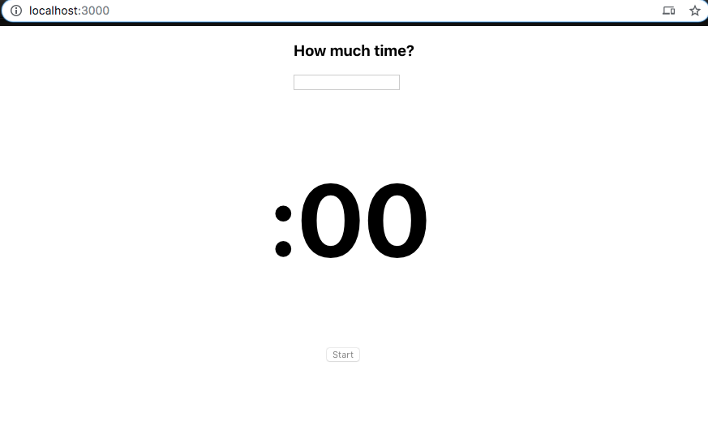
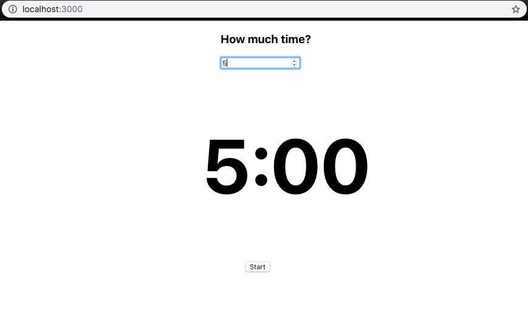
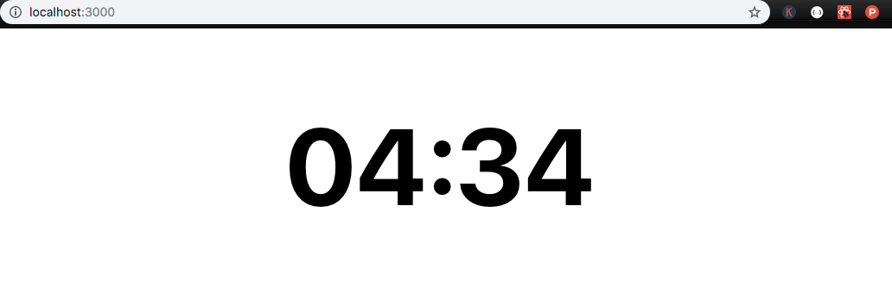

# React-Countdown

Created a few quick class components in react to bring together a simple timer/stopwatch. Type in the amount of time that you want to track, then CLICK 'start'! Simple as that.

#### Can easily pull it down and run it, if you would like.

## Technologies Used:
____
* Visual Studio
* Javascript, React.js 

## Screenshots :
____

